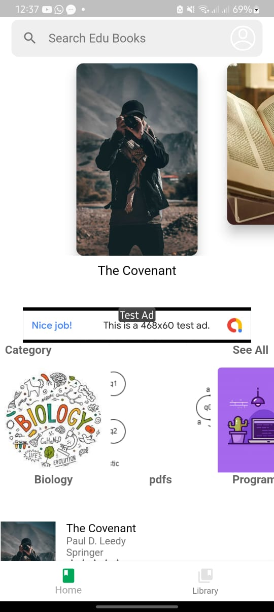
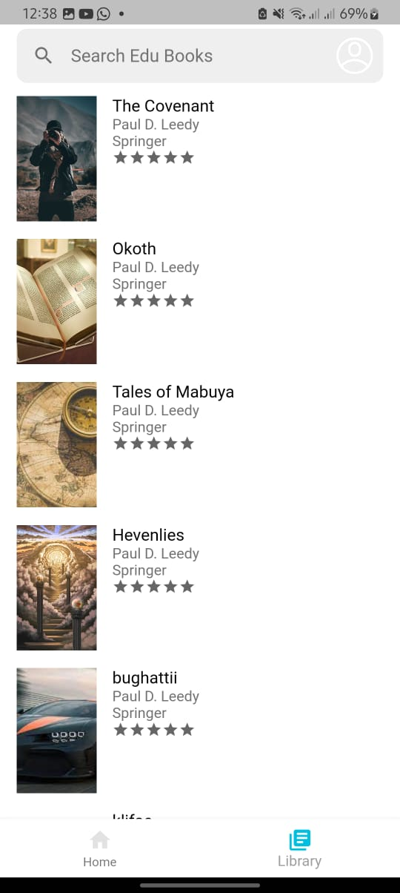
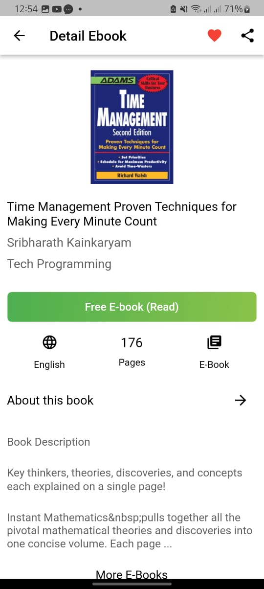
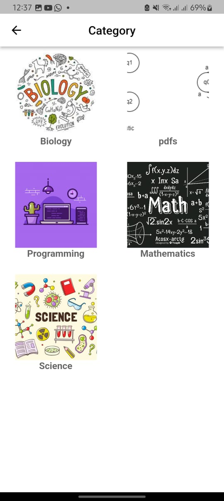

# 📖📖 MemoryMate (Flutter eBook App)
A Flutter based application, designed to to enhance memorability through recall prompts .

## ✨ Key Features

- Login and register page
- Admin page. 
  - Add a book
  - Remove a book
  - Add Categories
- Users side
  - Create a profile
  - Download a book
  - Read a book
  - Highlight text
  - Make annotation
  - Add reminders

## 💻 Requirements

- Any Operating System (ie. MacOS X, Linux, Windows)
- Any IDE with Flutter SDK installed (ie. IntelliJ, Android Studio, VSCode etc)
- A little knowledge of Dart and Flutter
- A Xammp server

 ## Usage
```
git clone https://github.com/creatint/light
flutter packages get
flutter run
flutter build apk --release
```

## 📸 ScreenShots
|   |   |
|   |   |
|   |   |

## 🔌 Plugins

| Name                                                                   | Usage                                         |
| ---------------------------------------------------------------------- | --------------------------------------------- |
| [**Riverpod**](https://pub.dev/packages/flutter_riverpod)              | State Management                              |
| [**Sembast**](https://pub.dev/packages/sembast)                        | NoSQL database to store Favorites & Downloads |
| [**XML2JSON**](https://pub.dev/packages/xml2json)                      | Convert XML to JSON                           |
| [**DIO**](https://pub.dev/packages/dio)                                | Network calls and File Download               |
| [**Iridium Reader**](https://github.com/Mantano/iridium_reader_widget) | Plug and play reader widget for pdfs         |
